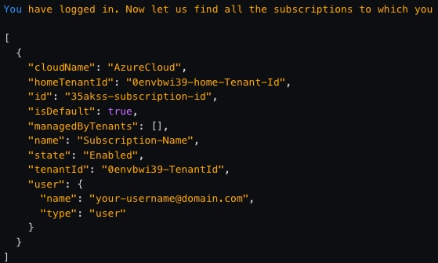
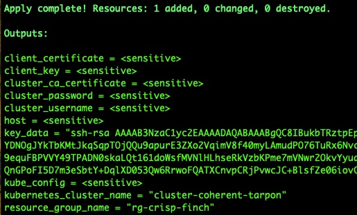
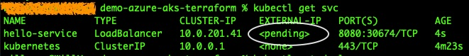
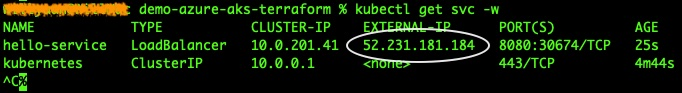

# demo-azure-aks-terraform

## Prerequisites

* [Terraform](https://developer.hashicorp.com/terraform/install) is installed
* [Azure CLI](https://learn.microsoft.com/en-us/cli/azure/install-azure-cli) is installed
* [kubectl](https://kubernetes.io/releases/download/) is installed
* A valid Azure subscription.
    - [Get a free one](https://azure.microsoft.com/en-us/free/).
    - [Pay as you go](https://azure.microsoft.com/en-us/pricing/purchase-options/pay-as-you-go).

## Let's run it

:bell: **Notice:** Don't change any `*.tfstate.*` files manually during the whole process. 
They are managed by Terraform automatically.

### 1. Setup Azure authentication

```shell
az login
```

If you have successfully logged in, you'll see output like this:



Write down the `id` (subscription id) and `tenantId` here, you'll need them later. If you don't see or have missed the above output for some reason, you can try this command to recall it (a successful login is still required):

```shell
az account list
```

Once you've got your subscription id and tenant id, carry on with the following steps:

```shell
# set current active subscription
az account set --subscription "<SUBSCRIPTION_ID>"
```

```shell
# create a service principal
az ad sp create-for-rbac --role="Contributor" --scopes="/subscriptions/<SUBSCRIPTION_ID>"
```

Write down the `appId` and `password` from the output. Now set some necessary environment variables.

For shell:

```shell
export ARM_CLIENT_ID="<APPID_VALUE>"
export ARM_CLIENT_SECRET="<PASSWORD_VALUE>"
export ARM_SUBSCRIPTION_ID="<SUBSCRIPTION_ID>"
export ARM_TENANT_ID="<TENANT_ID>"

# check it
printenv | grep '^ARM*'
```

For PowerShell:

```powershell
$Env:ARM_CLIENT_ID = "<APPID_VALUE>"
$Env:ARM_CLIENT_SECRET = "<PASSWORD_VALUE>"
$Env:ARM_SUBSCRIPTION_ID = "<SUBSCRIPTION_ID>"
$Env:ARM_TENANT_ID = "<TENANT_ID>"

# check it
gci env:ARM_*
```

### 2. Run Terraform to create an AKS cluster

```shell
terraform init

# optional:
terraform plan

terraform apply
```

If the last command `terraform apply` succeeds, you should be able to see something like this:



The values of the last few output variables `*_name` may vary for each run. Now connect to AKS:

For shell:

```shell
echo "$(terraform output kube_config | grep -v EOT)" > ./aks_cfg

export KUBECONFIG=./aks_cfg

kubectl get nodes
```

For PowerShell:

```powershell
# According to my test with Windows, this command would leave quite a lot annoying
# line breakers among those BASE64 key values. If you face the same thing, please
# open this file with your favorite editor, and remove them before you continue.
terraform output kube_config | Select-String -NotMatch EOT > ./aks_cfg

$Env:KUBECONFIG = "./aks_cfg"

kubectl get nodes
```

### 3. Deploy a demo application to AKS

This step is just to create a very basic get-started application. If you want to see a fuller example, 
please use this [manifest](https://github.com/Azure-Samples/aks-store-demo/blob/main/aks-store-quickstart.yaml) instead,
or dive deeper to the official repository: [Azure-Samples/aks-store-demo](https://github.com/Azure-Samples/aks-store-demo).

```shell
kubectl apply -f apps/one-single-nginx.yml
```

Check it
```shell
kubectl get deployment
kubectl get pod

kubectl get service -w
```

When you've just executed the last command, before a valid public IP is assigned, you should be able to see something 
like below, `EXTERNAL-IP` is `pending` there:



After a while, once you see a valid public IP is assigned, press `CTRL+C` to terminate the command.



Now you can use the external IP above to access the service via a browser:

```
http://<EXTERNAL_IP>:8080
```

### 4. Destroy everything you've just created
```shell
terraform destroy
```

## Relevant repositories

* [will8ug/learn-terraform-aks](https://github.com/will8ug/learn-terraform-aks)

* [will8ug/demo-azure-linux-vm-terraform](https://github.com/will8ug/demo-azure-linux-vm-terraform)
